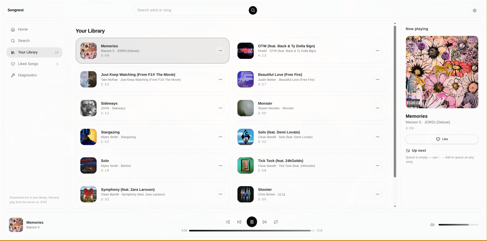

# Songnest

Songnest is a music library and player with a pluggable source system,
desktop-first, built with Tauri, Rust and React.

> **Status: early alpha. Expect breaking changes.**

What works today:

- Metadata search, suggestions, and a local library with likes.
- Playback of saved tracks, plus proxied streaming for unsaved ones.
- A save-to-library queue (max 2 at a time) with request pacing and
  rate-limit handling, progress, and health reporting.
- Source health and diagnostics screen (backend versions, update status,
  cooldown state).
- Desktop app (Tauri) that spawns and manages the backend automatically.
- Android builds are **experimental** (thin client over your local network).

Planned or experimental:

- Legal-source support — planned.
- Source health checks and updates — available.
- Mobile builds — experimental.
- Local-file import — planned.
- Loudness normalization — planned.

## Screenshots

Current prototype (desktop library view):



## Quick start

Prerequisites: a recent Rust toolchain and Node.js. Optional, installed
and configured by you: `yt-dlp` and a JavaScript runtime (Deno 2.3+, or
Node.js 22+) for source challenge-solving.

```sh
# backend API + queue workers (http://127.0.0.1:8787)
cargo run -p songnest-cli -- serve

# web frontend (dev)
cd web
npm install
npm run dev -- --port 1420 --strictPort

# type check + production frontend build
npm run build

# lint
npm run lint
```

Desktop app (builds the backend binary as a sidecar, then the app):

```sh
cd web
npm run desktop:sidecar
npm run desktop:build
```

Android (experimental thin client; needs the Android SDK):

```sh
cd web
npx tauri android build --apk
```

Tests and checks:

```sh
cargo test --workspace
cargo clippy --workspace
cd web && npm run build
```

## How it works

- Track metadata comes from a public catalog API.
- A pluggable source layer matches catalog entries to playable audio,
  caches matches and stream URLs, and keeps a local SQLite library.
- Saved tracks live as tagged audio files in the data directory; the
  bundled web UI talks to the local server over HTTP.
- `yt-dlp`, when used, is an optional separate tool installed and
  configured by the user. It is not bundled with Songnest.

## Responsible use

Songnest does not host, distribute, or provide any music. It is a player
and library manager. Users are solely responsible for complying with
copyright law and the terms of any service they connect to, and for the
source of any files they use. Prefer sources with licenses that allow
saving copies (Creative Commons catalogs, music you own).

## Not affiliated

Songnest is not affiliated with or endorsed by any streaming or video
service.

## Contributing

See [CONTRIBUTING.md](CONTRIBUTING.md). Please follow the
[Code of Conduct](CODE_OF_CONDUCT.md). Report security issues privately
as described in [SECURITY.md](SECURITY.md).

## License

Licensed under either of [MIT](LICENSE-MIT) or
[Apache-2.0](LICENSE-APACHE), at your option. Third-party Rust
dependency licenses are listed in
[THIRD_PARTY_LICENSES.md](THIRD_PARTY_LICENSES.md).
